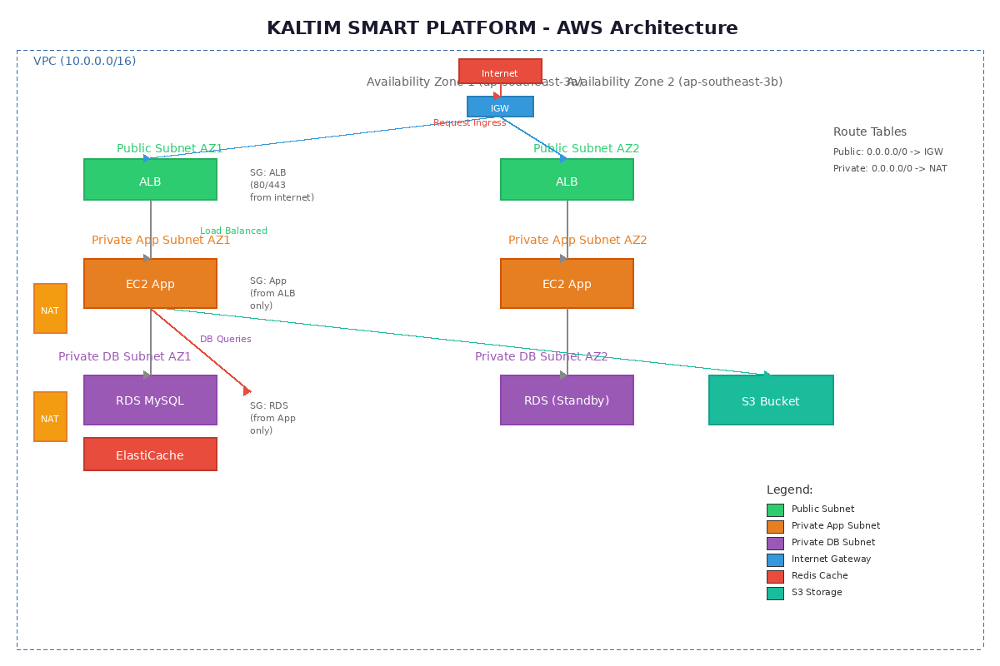

# Deployment Guide - Kaltim Smart Platform

Panduan lengkap deploy Kaltim Smart Platform ke AWS menggunakan Terraform + langkah manual.

---

## Daftar Isi
1. [Prasyarat](#1-prasyarat)
2. [Persiapan AWS Account](#2-persiapan-aws-account)
3. [Deploy Infrastruktur dengan Terraform](#3-deploy-infrastruktur-dengan-terraform)
4. [Setup Aplikasi di EC2](#4-setup-aplikasi-di-ec2)
5. [Konfigurasi Amazon Lex (Chatbot AI)](#5-konfigurasi-amazon-lex-chatbot-ai)
6. [Verifikasi & Testing](#6-verifikasi--testing)
7. [Monitoring & Logging](#7-monitoring--logging)
8. [Arsitektur AWS](#8-arsitektur-aws)

---

## 1. Prasyarat

| Tools | Versi | Cara Install |
|---|---|---|
| Terraform | >= 1.5 | `brew install terraform` / download dari hashicorp.com |
| AWS CLI | >= 2.0 | `brew install awscli` / download dari aws.amazon.com |
| Git | any | `brew install git` |
| SSH Key | - | `ssh-keygen -t rsa -b 4096` |

---

## 2. Persiapan AWS Account

### 2.1 Buat IAM User (AWS Console)

1. Buka **AWS Console** → **IAM** → **Users** → **Create user**
2. Nama: `kaltim-terraform`
3. Centang **Provide user access to the AWS Management Console** → **I want to create an IAM user**
4. Pilih **Attach policies directly**, centang:
   - `AdministratorAccess` (atau custom policy untuk production)
5. Klik **Next** → **Create user**
6. Klik user yang baru dibuat → tab **Security credentials** → **Create access key**
7. Pilih **Command Line Interface (CLI)** → **Next** → **Create access key**
8. **Simpan** Access Key ID dan Secret Access Key (hanya muncul sekali!)

### 2.2 Konfigurasi AWS CLI

```bash
aws configure
# AWS Access Key ID: AKIA... (dari langkah 2.1)
# AWS Secret Access Key: ... (dari langkah 2.1)
# Default region name: ap-southeast-3 (Jakarta)
# Default output format: json
```

Verifikasi:
```bash
aws sts get-caller-identity
# Harus menampilkan UserId, Account, Arn
```

### 2.3 Buat SSH Key Pair (AWS Console)

1. Buka **AWS Console** → **EC2** → **Key Pairs** → **Create key pair**
2. Nama: `kaltim-key`
3. Type: RSA, Format: `.pem`
4. Klik **Create key pair** → file `.pem` akan terdownload otomatis
5. Simpan dan ubah permission:
   ```bash
   mv ~/Downloads/kaltim-key.pem ~/.ssh/
   chmod 400 ~/.ssh/kaltim-key.pem
   ```

### 2.4 Siapkan Domain (Opsional)

Jika ada domain (contoh: kaltim.go.id), buat **Route 53 Hosted Zone**:
1. AWS Console → **Route 53** → **Hosted zones** → **Create hosted zone**
2. Domain name: `kaltim.go.id`, Type: Public
3. Copy NS records ke registrar domain Anda

---

## 3. Deploy Infrastruktur dengan Terraform

### 3.1 Clone Repository

```bash
git clone https://github.com/[username]/lks-kaltim-2026-[kode-peserta].git
cd lks-kaltim-2026-[kode-peserta]/terraform
```

### 3.2 Buat Konfigurasi Variabel

```bash
# Generate APP_KEY di lokal dulu
cd ..
php artisan key:generate --show
# Copy output-nya: base64:...

php artisan jwt:secret --show
# Copy output-nya

# Buat file terraform.tfvars
cd terraform
cat > terraform.tfvars << 'EOF'
# Region
aws_region       = "ap-southeast-3"

# Project
project_name     = "kaltim-smart-platform"
environment      = "production"

# Compute
key_name         = "kaltim-key"
instance_type    = "t3.medium"

# Database
db_username      = "kaltim_admin"
db_password      = "K4lt1m#Secure2026!"
db_name          = "kaltim_smart_platform"

# Application secrets (dari langkah di atas)
app_key          = "base64:..."
jwt_secret       = "...jwt-secret-hash..."

# S3 (harus unique global)
s3_bucket_name   = "kaltim-uploads-[kode-peserta]-2026"
EOF
```

> ⚠️ **Penting:** Ganti `db_password`, `app_key`, `jwt_secret`, dan `s3_bucket_name` dengan nilai asli!

### 3.3 Jalankan Terraform

```bash
# Inisialisasi
terraform init

# Preview perubahan
terraform plan

# Deploy infrastruktur (ketik "yes" untuk konfirmasi)
terraform apply
```

Tunggu ~10-15 menit sampai selesai. Terraform akan menampilkan output:
```
alb_dns_name = "kaltim-smart-platform-alb-123456.ap-southeast-3.elb.amazonaws.com"
rds_endpoint = "kaltim-smart-platform-db.xxxx.ap-southeast-3.rds.amazonaws.com:3306"
s3_bucket_name = "kaltim-uploads-xxx-2026"
vpc_id = "vpc-xxx"
lex_bot_id = "XXX"
lex_bot_alias_id = "XXX"
```

### 3.4 Catat Output

Simpan output ini — akan dipakai di langkah selanjutnya:
```bash
terraform output > outputs.txt
cat outputs.txt
```

---

## 4. Setup Aplikasi di EC2

### 4.1 SSH ke EC2 Instance

Setelah Terraform selesai, EC2 instance sudah berjalan di private subnet. Akses melalui bastion host atau:

```bash
# Dapatkan EC2 instance ID
aws ec2 describe-instances \
  --filters "Name=tag:Name,Values=kaltim-smart-platform-instance" \
  --query "Reservations[0].Instances[0].InstanceId" --output text

# Connect via SSM (Systems Manager Session Manager - tanpa perlu public IP)
aws ssm start-session --target i-xxxxxxxxxxxxx
```

> Jika tidak pakai SSM, deploy dulu bastion host di public subnet, lalu SSH tunnel ke private instance.

### 4.2 Clone & Setup Aplikasi

```bash
# Di dalam EC2 instance
sudo yum update -y
sudo yum install -y git docker
sudo systemctl enable docker && sudo systemctl start docker
sudo usermod -aG docker ec2-user

# Clone repo
git clone https://github.com/[username]/lks-kaltim-2026-[kode-peserta].git /opt/kaltim-app
cd /opt/kaltim-app/docker

# Copy env file
cp .env.example .env

# Edit docker/.env
cat > .env << 'EOF'
APP_KEY=base64:...         # sama dengan terraform.tfvars
JWT_SECRET=...             # sama dengan terraform.tfvars
DB_DATABASE=kaltim_smart_platform
DB_USERNAME=kaltim_admin
DB_PASSWORD=K4lt1m#Secure2026!   # sama dengan terraform.tfvars
DB_ROOT_PASSWORD=root_secret_123
APP_PORT=80
APP_URL=http://<alb-dns-name>
AWS_ACCESS_KEY_ID=AKIA...
AWS_SECRET_ACCESS_KEY=...
AWS_DEFAULT_REGION=ap-southeast-3
AWS_BUCKET=kaltim-uploads-xxx-2026
AWS_LEX_BOT_ID=XXX          # dari output terraform
AWS_LEX_BOT_ALIAS_ID=YYY    # dari output terraform
CACHE_STORE=redis
SESSION_DRIVER=redis
FILESYSTEM_DISK=s3
EOF
```

### 4.3 Jalankan Aplikasi

```bash
cd /opt/kaltim-app/docker
docker compose up -d --build

# Cek status
docker compose ps
docker compose logs app | tail -20
```

---

## 5. Konfigurasi Amazon Lex (Chatbot AI)

Chatbot otomatis aktif saat `AWS_LEX_BOT_ID` diset. Berikut setup di AWS Console:

### 5.1 Build Bot (AWS Console)

1. Buka **AWS Console** → **Amazon Lex** → **Create bot**
2. Pilih **Create a blank bot**
3. Nama: `KaltimServiceBot`
4. IAM permissions: **Create a role with basic Amazon Lex permissions**
5. Children's Online Privacy Protection Act: **No**
6. Idle timeout: 5 menit → **Next**
7. Language: **Indonesian (id_ID)** → **Done**

### 5.2 Tambahkan Intent

**Klik intent FallbackIntent** (default), lalu tambah intent baru:

| Intent Name | Sample Utterances | Response |
|---|---|---|
| GreetingIntent | "halo", "selamat pagi", "hai" | "Halo! Ada yang bisa saya bantu seputar layanan publik?" |
| KTPIntent | "cara buat KTP", "syarat e-KTP" | "Untuk membuat KTP: daftar akun, pilih Layanan > Pembuatan KTP..." |
| KKIntent | "buat kartu keluarga", "syarat KK" | "KK bisa diajukan online. Estimasi 7 hari kerja..." |
| LaporIntent | "lapor jalan rusak", "aduan sampah" | "Laporkan di menu Laporan Warga, pilih kategori..." |

### 5.3 Build & Publish

1. Klik **Build** (tunggu ~2 menit)
2. Setelah build selesai, klik **Deploy** → **Create alias**
3. Alias name: `prod` → **Create**

### 5.4 Dapatkan Bot ID & Alias ID

1. Kembali ke daftar bot → klik bot `KaltimServiceBot`
2. **Bot ID** ada di pojok kanan atas (format: `XXXXXXXXXX`)
3. Klik **Aliases** → klik alias `prod` → **Alias ID** di pojok kanan atas (format: `YYYYYYYYYY`)

### 5.5 Update Environment

```bash
# Di EC2 instance
cd /opt/kaltim-app/docker
echo "AWS_LEX_BOT_ID=XXXXXXXXXX" >> .env
echo "AWS_LEX_BOT_ALIAS_ID=YYYYYYYYYY" >> .env
docker compose up -d --build
```

---

## 6. Verifikasi & Testing

### 6.1 Cek Kesehatan

```bash
# Health check (via browser atau curl)
curl http://<alb-dns-name>/health

# API Health (JSON)
curl http://<alb-dns-name>/api/health
# Harus return: {"success":true,"message":"All systems operational"}
```

### 6.2 Test API

```bash
# Daftar layanan publik
curl http://<alb-dns-name>/api/services

# Login admin
curl -X POST http://<alb-dns-name>/api/auth/login \
  -H "Content-Type: application/json" \
  -d '{"email":"admin@kaltim.go.id","password":"password"}'

# Dashboard (pakai token dari response login)
curl http://<alb-dns-name>/api/dashboard/stats \
  -H "Authorization: Bearer <token>"
```

### 6.3 Test Web UI

Buka `http://<alb-dns-name>` di browser:
- Login sebagai admin: `admin@kaltim.go.id` / `password`
- Login sebagai warga: `budi@email.com` / `password`
- Chatbot: klik bubble 💬 di kanan bawah

### 6.4 Test Upload File (S3)

1. Login sebagai warga
2. Buat laporan dengan upload foto
3. Cek AWS Console → S3 → bucket `kaltim-uploads-xxx` → file harus ada

---

## 7. Monitoring & Logging

### 7.1 CloudWatch Logs

```bash
# Lihat log aplikasi
aws logs tail /ecs/kaltim-app --follow

# Atau via AWS Console → CloudWatch → Log groups
```

### 7.2 RDS Monitoring

AWS Console → **RDS** → **Databases** → klik `kaltim-smart-platform-db` → tab **Monitoring**
- CPU Utilization
- Database Connections
- Free Storage Space
- Read/Write IOPS

### 7.3 EC2 & ALB Monitoring

AWS Console → **EC2** → **Auto Scaling Groups** → `kaltim-smart-platform-asg` → tab **Monitoring**

AWS Console → **EC2** → **Load Balancers** → `kaltim-smart-platform-alb` → tab **Monitoring**
- Request Count
- Target Response Time
- HTTP 5XX Count

### 7.4 CloudWatch Alarms (Opsional)

```bash
# Contoh: Alarm jika CPU > 80%
aws cloudwatch put-metric-alarm \
  --alarm-name kaltim-high-cpu \
  --metric-name CPUUtilization \
  --namespace AWS/EC2 \
  --statistic Average \
  --period 300 \
  --threshold 80 \
  --comparison-operator GreaterThanThreshold \
  --evaluation-periods 2
```

---

## 8. Arsitektur AWS



```
                          INTERNET
                              │
                              ▼
              ┌───────────────────────────────┐
              │    Application Load Balancer  │  Public Subnets (AZ1 + AZ2)
              │    (port 80/443)              │
              └───────────────┬───────────────┘
                              │
              ┌───────────────┴───────────────┐
              │                               │
              ▼                               ▼
    ┌──────────────────┐          ┌──────────────────┐
    │  EC2 App (AZ1)   │          │  EC2 App (AZ2)   │  Private App Subnets
    │  Docker +        │          │  Docker +        │
    │  PHP-FPM + Nginx │          │  PHP-FPM + Nginx │
    └───┬──────┬───────┘          └───┬──────┬───────┘
        │      │                      │      │
        │      │     ┌────────────────┘      │
        ▼      │     │                       │
  ┌─────────┐  │     │     ┌─────────────────┘
  │   RDS   │  │     │     │
  │  MySQL  │  │     │     │
  │ (AZ1)   │  │     │     │
  └─────────┘  │     │     │
               │     │     │
  Private DB   │     │     │
  Subnets      ▼     │     ▼
          ┌──────────────┐  ┌─────────┐
          │ ElastiCache  │  │   S3    │
          │   Redis      │  │ Uploads │
          └──────────────┘  └─────────┘

  ALL WITHIN VPC 10.0.0.0/16
  ├── Public Subnets:    10.0.1.0/24, 10.0.2.0/24
  ├── App Subnets:       10.0.10.0/24, 10.0.11.0/24
  └── DB Subnets:        10.0.20.0/24, 10.0.21.0/24
```

### Komponen AWS

| Komponen | Resouce | Deskripsi |
|---|---|---|
| VPC | 10.0.0.0/16 | Virtual Private Cloud |
| Subnet Publik | 2 AZ | Untuk ALB |
| Subnet App | 2 AZ | Untuk EC2 instances |
| Subnet DB | 2 AZ | Untuk RDS + ElastiCache |
| IGW | 1 | Internet Gateway |
| NAT Gateway | 1 | Outbound internet untuk private subnet |
| ALB | 1 | Application Load Balancer |
| EC2 ASG | 2-4 instances | Auto Scaling Group (t3.medium) |
| RDS | 1 (Multi-AZ: false) | MySQL 8.0 (db.t3.micro) |
| ElastiCache | 1 | Redis 7 (cache.t3.micro) |
| S3 | 1 bucket | File uploads (versioned, AES-256, blocked public access) |
| Lex | 1 bot | Chatbot AI Bahasa Indonesia |
| Route Tables | 3 | Public, App Private, DB Private |
| Security Groups | 4 | ALB, App, RDS, ElastiCache (least privilege) |

---

## 9. Pengujian Mandiri (Wajib Sebelum Pengumpulan)

### 9.1 Uji API dengan Postman

#### 9.1.1 Setup Postman Collection

1. Buka **Postman** → **New Collection** → nama: `Kaltim Smart Platform`
2. Klik **Variables** → tambahkan:
   | Variable | Value |
   |---|---|
   | `base_url` | `http://<alb-dns-name>` (ganti dengan ALB URL asli) |
   | `token` | (kosong dulu, akan diisi setelah login) |

#### 9.1.2 Test Autentikasi

**Register:**
```
POST {{base_url}}/api/auth/register
Body (JSON):
{
  "name": "Test User",
  "email": "test@example.com",
  "password": "password123",
  "phone": "08123456789",
  "address": "Jl. Test No. 1"
}

Expected Response (201):
✅ success = true
✅ data.user.role = "citizen"
✅ data.token exists (JWT)
```

**Login Admin:**
```
POST {{base_url}}/api/auth/login
Body (JSON):
{
  "email": "admin@kaltim.go.id",
  "password": "password"
}

Expected Response (200):
✅ success = true
✅ data.token exists
```

> Setelah login, copy token → paste ke Collection variable `token`

**Login Warga:**
```
POST {{base_url}}/api/auth/login
Body (JSON):
{
  "email": "budi@email.com",
  "password": "password"
}
```

**Profile:**
```
GET {{base_url}}/api/auth/profile
Authorization: Bearer {{token}}

Expected Response (200):
✅ data.role exists
✅ data.email exists
```

**Logout:**
```
POST {{base_url}}/api/auth/logout
Authorization: Bearer {{token}}

Expected Response (200):
✅ success = true
```

#### 9.1.3 Test Layanan Publik

**Daftar Layanan:**
```
GET {{base_url}}/api/services

Expected Response (200):
✅ data is array
✅ data[0].name exists
```

**Ajukan Layanan (sebagai warga):**
```
POST {{base_url}}/api/services/request
Authorization: Bearer <warga_token>
Body (JSON):
{
  "service_type_id": 1,
  "description": "Pengajuan test"
}

Expected Response (201):
✅ success = true
✅ data.status = "pending"
```

**Update Status (sebagai admin):**
```
PUT {{base_url}}/api/services/request/1/status
Authorization: Bearer <admin_token>
Body (JSON):
{ "status": "processing" }

Expected Response (200):
✅ success = true
```

**Cek Notifikasi Warga (harus ada notif baru):**
```
GET {{base_url}}/api/notifications
Authorization: Bearer <warga_token>

Expected Response (200):
✅ data.data[0].message contains "berubah"
```

#### 9.1.4 Test Laporan Warga

**Buat Laporan:**
```
POST {{base_url}}/api/reports
Authorization: Bearer <warga_token>
Body (JSON):
{
  "category": "infrastructure",
  "title": "Jalan Berlubang Test",
  "description": "Test laporan jalan berlubang",
  "location": "Jl. Test"
}

Expected Response (201):
✅ success = true
✅ data.status = "open"
```

**Lihat Laporan (admin - harus lihat semua):**
```
GET {{base_url}}/api/reports
Authorization: Bearer <admin_token>

Expected Response (200):
✅ data.data contains multiple reports
```

**Lihat Laporan (warga - hanya miliknya):**
```
GET {{base_url}}/api/reports
Authorization: Bearer <warga_token>

Expected Response (200):
✅ Semua data.data[].user_id sama dengan user login
```

#### 9.1.5 Test Dashboard Admin

**Statistik:**
```
GET {{base_url}}/api/dashboard/stats
Authorization: Bearer <admin_token>

Expected Response (200):
✅ data.users exists
✅ data.reports exists
✅ data.service_requests exists
```

**Rekapitulasi per Kategori:**
```
GET {{base_url}}/api/dashboard/reports/summary
Authorization: Bearer <admin_token>

Expected Response (200):
✅ data is array of { category, total }
```

#### 9.1.6 Test Keamanan (RBAC)

**Warga akses dashboard admin → HARUS 403:**
```
GET {{base_url}}/api/dashboard/stats
Authorization: Bearer <warga_token>

Expected Response (403):
✅ success = false
✅ message contains "Unauthorized" atau "Insufficient permissions"
```

**Warga update status layanan → HARUS 403:**
```
PUT {{base_url}}/api/services/request/1/status
Authorization: Bearer <warga_token>
Body (JSON): { "status": "done" }

Expected Response (403):
✅ success = false
```

**Tanpa token akses endpoint → HARUS 401:**
```
GET {{base_url}}/api/auth/profile
(Tanpa Authorization header)

Expected Response (401):
✅ Unauthorized / Token not provided
```

**S3 Block Public Access:**
```
# Buka browser, akses:
https://<s3-bucket-name>.s3.ap-southeast-3.amazonaws.com/

Expected:
✅ Access Denied (XML error)
❌ BUKAN list of objects
```

**HTTP → HTTPS Redirect (jika ada ACM/SSL):**
```
curl -I http://<alb-dns-name>

Expected:
✅ HTTP/1.1 301 Moved Permanently
✅ Location: https://...
```

#### 9.1.7 Health Check

**Web Health:**
```
Buka browser: http://<alb-dns-name>/health

Expected:
✅ Menampilkan "All Systems Operational"
✅ Database: OK (mysql)
✅ Cache: OK (redis)
✅ Storage: OK
```

**API Health:**
```
GET {{base_url}}/api/health

Expected Response (200):
✅ success = true
✅ data.database.status = "ok"
✅ data.cache.status = "ok"
✅ data.storage.status = "ok"
```

#### 9.1.8 Chatbot Test

**Web Chatbot:**
```
Buka browser: http://<alb-dns-name> → klik bubble 💬

Ketik: "cara buat ktp"

Expected:
✅ Bot membalas dengan panduan pembuatan KTP
```

**API Chatbot:**
```
POST {{base_url}}/api/chatbot
Body (JSON): { "message": "cara daftar akun" }

Expected Response (200):
✅ reply contains instruksi registrasi
```

#### 9.1.9 Validasi Format Response JSON

Semua endpoint API harus mengembalikan format:
```json
{
  "success": true|false,
  "message": "string",
  "data": { ... }
}
```

> ✅ Cek di setiap response Postman: field `success`, `message`, `data` harus selalu ada.

#### 9.1.10 Validasi Pagination

```
GET {{base_url}}/api/reports?per_page=2&page=1

Expected Response (200):
✅ data.current_page = 1
✅ data.per_page = 2
✅ data.data.length <= 2
✅ data.links exists
✅ data.total exists
```

### 9.2 Ekspor Postman Collection

1. Di Postman, klik **...** pada collection `Kaltim Smart Platform`
2. Pilih **Export** → Format: **Collection v2.1** → **Export**
3. Simpan file sebagai `Kaltim-Smart-Platform.postman_collection.json`

---

## 10. 📦 Checklist Pengumpulan Lomba (Pukul 17.00 WITA)

### 10.1 URL Deployment Live
- [ ] ALB DNS: `http://<alb-dns-name>` (aktif & bisa diakses)
- [ ] Simpan di `README.md` bagian atas

### 10.2 Postman Collection
- [ ] File: `Kaltim-Smart-Platform.postman_collection.json`
- [ ] Semua endpoint sudah di-test
- [ ] Response sesuai ekspektasi (success/error, format JSON, pagination)

### 10.3 Screenshot CloudWatch Dashboard

Buka AWS Console → **CloudWatch** → **Dashboards** → **Create dashboard**

Tambahkan widget berikut:
1. **EC2 CPU Utilization** (line graph)
2. **ALB Request Count** (number)
3. **RDS Database Connections** (line graph)
4. **Target Response Time** (line graph)

> Screenshot dashboard yang menampilkan semua widget → simpan sebagai `cloudwatch-dashboard.png`

### 10.4 CloudTrail Log + S3 Presigned URL

#### Aktifkan CloudTrail (jika belum):
1. AWS Console → **CloudTrail** → **Create trail**
2. Trail name: `kaltim-trail`
3. Centang **Enable for all accounts in my organization** (jika ada)
4. Pilih S3 bucket untuk menyimpan log → **Next** → **Create trail**

#### Generate Presigned URL:

```bash
# Via AWS CLI (berlaku 1 jam)
aws s3 presign s3://<cloudtrail-bucket>/AWSLogs/<account-id>/CloudTrail/<region>/<date>/ \
  --expires-in 3600

# Simpan URL yang dihasilkan
```

> ⚠️ Presigned URL HARUS dibuat **maksimal 1 jam sebelum pengumpulan (sekitar pukul 16.00 WITA)**

### 10.5 Update README.md

```markdown
## Deployment Live
- **URL:** http://<alb-dns-name>
- **Health Check:** http://<alb-dns-name>/health
- **API Docs:** http://<alb-dns-name>/api-info
```

---

## Perkiraan Biaya Bulanan

| Layanan | Spesifikasi | Estimasi/biaya |
|---|---|---|
| EC2 | 2x t3.medium | ~$60 |
| RDS | db.t3.micro | ~$15 |
| ElastiCache | cache.t3.micro | ~$12 |
| ALB | 1 ALB | ~$20 |
| S3 | 1 GB | ~$0.02 |
| Lex | ~1000 req/hari | ~$5 |
| NAT Gateway | 1 | ~$32 |
| **Total** | | **~$144/bulan** |
